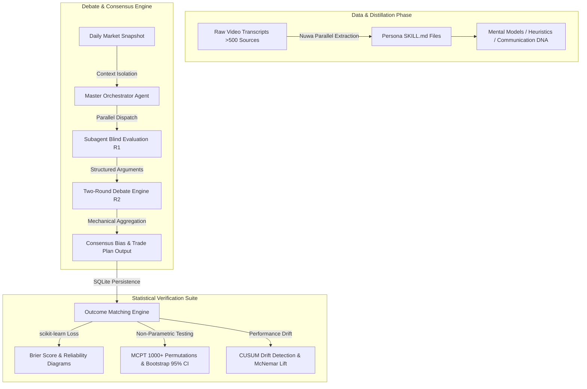

# Multi-Agent Consensus & Persona Distillation Framework (`traders-debate-system`)

> An open-source research framework for distilling domain-expert mental models from unstructured transcript data into executable LLM persona skills, orchestrating isolated multi-agent debate protocols, and statistically verifying consensus bias using Brier Scores, Monte Carlo Permutation Tests (MCPT), and Bootstrap Confidence Intervals.

[](https://www.python.org/)
[](tests/)
[](LICENSE)

---

## 📌 Executive Summary & Key Innovation

Traditional decision-making heuristics in financial and domain analysis are predominantly qualitative, embedded in raw video lectures or posts without standardized verification. This framework introduces an end-to-end open-source pipeline to:

1. **Distill**: Extract structured mindsets, decision heuristics, and communication DNA from 500+ raw video transcripts into executable `SKILL.md` persona files using LLM subagents (Nuwa Distillation Protocol).
2. **Orchestrate**: Execute parallel blind evaluations followed by a strict two-round debate protocol across isolated persona subagents (e.g., ICT, TJR, EmperorBTC) to synthesize a daily consensus trade plan and directional bias.
3. **Calibrate & Verify**: Persist predictions to an SQLite audit trail and validate predictive edge against real market outcomes using Brier Score loss functions, Reliability Diagrams, Monte Carlo Permutation Testing (MCPT), Walk-Forward Embargo, and CUSUM drift detection.

> **Project Scope**: Open-source research tool for multi-agent probability calibration and decision simulation. Not automated execution or financial advice.

---

## 🏗️ System Architecture & Workflow



---

## 🔬 Core Methodology & Statistical Design

### 1. Persona Distillation Engine (Nuwa Protocol)
- **Multi-Agent Extraction**: Processes over 500 video transcripts to synthesize 6 core mental models (e.g., algorithmic determination, liquidity magnets, PD Array multi-timeframe alignment) and 9 decision heuristics.
- **Triple Verification**: Every persona rule is validated across 3 criteria: cross-scenario repetition, predictive relevance, and mutual exclusion.
- **Built-in System Clauses**: Persona `SKILL.md` files feature automated scenario clauses that bypass trigger checking when loaded as system prompts by orchestrators.

### 2. Multi-Agent Debate & Isolation Architecture
- **Blind Initial Evaluation (Round 1)**: Subagents render independent direction (Long/Short/Neutral) and confidence (0–100%) without observing peer judgments to prevent anchoring bias.
- **Structured Cross-Examination (Round 2)**: Subagents critique peer logic using domain-specific heuristics.
- **Version-Controlled Protocol Governance (`PROTOCOL_VERSION`)**: Protocol evolution is strictly versioned (v1 through v6) to maintain deterministic audit trails and backward compatibility.

### 3. Statistical Verification & Calibration Suite
- **Brier Score Loss & Reliability Diagrams**: Measures probability calibration via $\text{BS} = \frac{1}{N}\sum (p_i - o_i)^2$ using `sklearn.calibration.brier_score_loss` and reliability binning.
- **Monte Carlo Permutation Testing (MCPT)**: Evaluates whether observed predictive accuracy exceeds random baseline chance by shuffling prediction-outcome pairs over $\ge 1,000$ iterations.
- **Walk-Forward Embargo & Look-Ahead Leakage Protection**: Enforces temporal embargo buffers between transcript corpus dates and backtest verification windows to eliminate language model look-ahead bias.
- **Ensemble Lift & McNemar's Test**: Evaluates whether multi-agent consensus significantly outperforms individual subagent accuracy using paired statistical tests.
- **CUSUM Drift Monitoring**: Tracks monthly performance drift to detect model degradation relative to out-of-sample baselines.

---

## 📁 Repository Layout

```
traders-debate-system/
├── engine/                       # Multi-agent debate orchestration & persona runners
│   ├── legacy_gemini_runner.py   # Legacy Gemini engine fallback
│   └── stance_rag.py             # Context retrieval & prompt packaging
├── database/                     # SQLite schema, outcome matching, & migrations
├── data/                         # Verified market context snapshots & report logs
├── tests/                        # PyTest suite with 65+ unit & integration tests
├── preregistration.md            # Formal scientific pre-registration protocol (§1–8)
├── Phase4_回測系統_規劃.md       # Statistical backtesting & calibration architecture doc
├── main.py                       # CLI entry point for execution and reporting
├── requirements.txt              # Dependency specifications (pytest, scikit-learn, etc.)
└── LICENSE                       # MIT License
```

---

## 🧪 Unit Testing & Quality Assurance

The framework features a comprehensive test suite covering edge cases, memory boundary isolation, and score calibration algorithms:

```bash
# Clone the repository
git clone https://github.com/D1349375/traders-debate-system.git
cd traders-debate-system

# Install dependencies
pip install -r requirements.txt

# Execute test suite (65+ tests)
pytest tests/ -v
```

Key test coverage includes:
- `test_trade_plan_required`: Enforces mandatory risk management parameters in agent outputs.
- `test_outcomes_horizon`: Verifies close-to-close outcome window calculations.
- `test_brier_score_bounds`: Validates calibration loss bounds under extreme consensus states.

---

## 📄 License

Distributed under the **MIT License**. See [LICENSE](LICENSE) for details.
